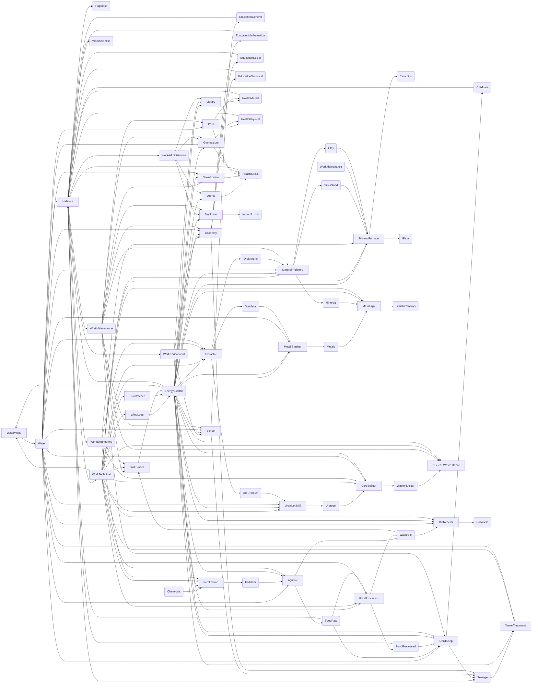

# Model

Buildings (rectangles) and resources (rounded rectangles), generated from `frontend/src/assets/buildings.md`.

```mermaid
graph LR
    B_WaterWells["WaterWells"]
    B_Habitats["Habitats"]
    B_Library["Library"]
    B_Agriplot["Agriplot"]
    B_Extractor["Extractor"]
    B_WindLoop["WindLoop"]
    B_SunCatcher["SunCatcher"]
    B_Arena["Arena"]
    B_MetalSmelter["Metal Smelter"]
    B_MineralRefinery["Mineral Refinery"]
    B_UraniumMill["Uranium Mill"]
    B_TownSquare["TownSquare"]
    B_Park["Park"]
    B_Fertilizatron["Fertilizatron"]
    B_ChildKeep["ChildKeep"]
    B_WaterTreatment["WaterTreatment"]
    B_CoreSplitter["CoreSplitter"]
    B_NuclearWasteDepot["Nuclear Waste Depot"]
    B_Gymnasium["Gymnasium"]
    B_FoodProcessor["FoodProcessor"]
    B_SkyTower["SkyTower"]
    B_School["School"]
    B_Academy["Academy"]
    B_BioFurnace["BioFurnace"]
    B_MineralFurnace["MineralFurnace"]
    B_BioReactor["BioReactor"]
    B_Metalurgy["Metalurgy"]
    R_Ceramics("Ceramics")
    R_Chemicals("Chemicals")
    R_Childcare("Childcare")
    R_Clay("Clay")
    R_EducationGeneral("EducationGeneral")
    R_EducationMathematical("EducationMathematical")
    R_EducationSocial("EducationSocial")
    R_EducationTechnical("EducationTechnical")
    R_EnergyElectric("EnergyElectric")
    R_Fertilizer("Fertilizer")
    R_FoodProcessed("FoodProcessed")
    R_FoodRaw("FoodRaw")
    R_Glass("Glass")
    R_Hapiness("Hapiness")
    R_HealthMental("HealthMental")
    R_HealthPhysical("HealthPhysical")
    R_HealthSocial("HealthSocial")
    R_ImportExport("ImportExport")
    R_Metals("Metals")
    R_Minerals("Minerals")
    R_OreMetal("OreMetal")
    R_OreMineral("OreMineral")
    R_OreUranium("OreUranium")
    R_Polymers("Polymers")
    R_Sewage("Sewage")
    R_SilicaSand("SilicaSand")
    R_StructuralAlloys("StructuralAlloys")
    R_Uranium("Uranium")
    R_WasteBio("WasteBio")
    R_WasteNuclear("WasteNuclear")
    R_Water("Water")
    R_WorkAdministrative("WorkAdministrative")
    R_WorkEducational("WorkEducational")
    R_WorkEngineering("WorkEngineering")
    R_WorkMainenance("WorkMainenance")
    R_WorkMaintenance("WorkMaintenance")
    R_WorkScientific("WorkScientific")
    R_WorkTechnical("WorkTechnical")

    R_EnergyElectric --> B_WaterWells
    R_WorkTechnical --> B_WaterWells
    B_WaterWells --> R_Water
    R_Water --> B_Habitats
    R_FoodRaw --> B_Habitats
    R_FoodProcessed --> B_Habitats
    R_EnergyElectric --> B_Habitats
    R_HealthPhysical --> B_Habitats
    R_HealthMental --> B_Habitats
    R_HealthSocial --> B_Habitats
    R_Childcare --> B_Habitats
    R_EducationGeneral --> B_Habitats
    R_EducationTechnical --> B_Habitats
    R_EducationMathematical --> B_Habitats
    R_EducationSocial --> B_Habitats
    B_Habitats --> R_Sewage
    B_Habitats --> R_Hapiness
    B_Habitats --> R_WorkMaintenance
    B_Habitats --> R_WorkTechnical
    B_Habitats --> R_WorkAdministrative
    B_Habitats --> R_WorkEngineering
    B_Habitats --> R_WorkEducational
    B_Habitats --> R_WorkScientific
    R_EnergyElectric --> B_Library
    R_WorkEducational --> B_Library
    R_WorkAdministrative --> B_Library
    B_Library --> R_HealthMental
    R_Water --> B_Agriplot
    R_Fertilizer --> B_Agriplot
    R_EnergyElectric --> B_Agriplot
    R_WorkTechnical --> B_Agriplot
    B_Agriplot --> R_FoodRaw
    B_Agriplot --> R_WasteBio
    R_EnergyElectric --> B_Extractor
    R_WorkTechnical --> B_Extractor
    R_WorkEngineering --> B_Extractor
    R_Water --> B_Extractor
    B_Extractor --> R_OreMetal
    B_Extractor --> R_OreMineral
    B_Extractor --> R_OreUranium
    R_WorkTechnical --> B_WindLoop
    B_WindLoop --> R_EnergyElectric
    R_WorkTechnical --> B_SunCatcher
    B_SunCatcher --> R_EnergyElectric
    R_EnergyElectric --> B_Arena
    R_WorkAdministrative --> B_Arena
    B_Arena --> R_HealthSocial
    R_WorkTechnical --> B_MetalSmelter
    R_EnergyElectric --> B_MetalSmelter
    R_Water --> B_MetalSmelter
    R_OreMetal --> B_MetalSmelter
    B_MetalSmelter --> R_Metals
    R_WorkTechnical --> B_MineralRefinery
    R_EnergyElectric --> B_MineralRefinery
    R_Water --> B_MineralRefinery
    R_OreMineral --> B_MineralRefinery
    R_WorkMaintenance --> B_MineralRefinery
    B_MineralRefinery --> R_Minerals
    B_MineralRefinery --> R_SilicaSand
    B_MineralRefinery --> R_Clay
    R_WorkTechnical --> B_UraniumMill
    R_EnergyElectric --> B_UraniumMill
    R_Water --> B_UraniumMill
    R_OreUranium --> B_UraniumMill
    B_UraniumMill --> R_Uranium
    R_WorkMaintenance --> B_TownSquare
    R_EnergyElectric --> B_TownSquare
    R_Water --> B_TownSquare
    B_TownSquare --> R_HealthSocial
    R_Water --> B_Park
    R_WorkMaintenance --> B_Park
    B_Park --> R_HealthPhysical
    B_Park --> R_HealthMental
    B_Park --> R_HealthSocial
    R_Chemicals --> B_Fertilizatron
    R_EnergyElectric --> B_Fertilizatron
    R_WorkTechnical --> B_Fertilizatron
    R_WorkEngineering --> B_Fertilizatron
    B_Fertilizatron --> R_Fertilizer
    R_Water --> B_ChildKeep
    R_FoodRaw --> B_ChildKeep
    R_FoodProcessed --> B_ChildKeep
    R_EnergyElectric --> B_ChildKeep
    R_WorkEducational --> B_ChildKeep
    R_WorkMaintenance --> B_ChildKeep
    B_ChildKeep --> R_Childcare
    B_ChildKeep --> R_Sewage
    R_Sewage --> B_WaterTreatment
    R_EnergyElectric --> B_WaterTreatment
    R_WorkTechnical --> B_WaterTreatment
    B_WaterTreatment --> R_Water
    R_Uranium --> B_CoreSplitter
    R_WorkTechnical --> B_CoreSplitter
    R_WorkEngineering --> B_CoreSplitter
    R_Water --> B_CoreSplitter
    B_CoreSplitter --> R_EnergyElectric
    B_CoreSplitter --> R_WasteNuclear
    R_WasteNuclear --> B_NuclearWasteDepot
    R_WorkMaintenance --> B_NuclearWasteDepot
    R_WorkTechnical --> B_NuclearWasteDepot
    R_EnergyElectric --> B_NuclearWasteDepot
    R_EnergyElectric --> B_Gymnasium
    R_Water --> B_Gymnasium
    R_WorkMaintenance --> B_Gymnasium
    R_WorkAdministrative --> B_Gymnasium
    B_Gymnasium --> R_HealthSocial
    B_Gymnasium --> R_HealthPhysical
    R_EnergyElectric --> B_FoodProcessor
    R_WorkTechnical --> B_FoodProcessor
    R_Water --> B_FoodProcessor
    R_FoodRaw --> B_FoodProcessor
    B_FoodProcessor --> R_FoodProcessed
    B_FoodProcessor --> R_WasteBio
    R_EnergyElectric --> B_SkyTower
    R_WorkAdministrative --> B_SkyTower
    R_WorkMaintenance --> B_SkyTower
    B_SkyTower --> R_ImportExport
    R_WorkEducational --> B_School
    R_EnergyElectric --> B_School
    R_Water --> B_School
    R_WorkMaintenance --> B_School
    B_School --> R_EducationGeneral
    B_School --> R_Sewage
    R_WorkEducational --> B_Academy
    R_EnergyElectric --> B_Academy
    R_Water --> B_Academy
    R_WorkMaintenance --> B_Academy
    B_Academy --> R_EducationSocial
    B_Academy --> R_Sewage
    B_Academy --> R_EducationMathematical
    B_Academy --> R_EducationTechnical
    R_WasteBio --> B_BioFurnace
    R_WorkMaintenance --> B_BioFurnace
    R_WorkTechnical --> B_BioFurnace
    R_WorkEngineering --> B_BioFurnace
    B_BioFurnace --> R_EnergyElectric
    R_EnergyElectric --> B_MineralFurnace
    R_WorkTechnical --> B_MineralFurnace
    R_WorkEngineering --> B_MineralFurnace
    R_SilicaSand --> B_MineralFurnace
    R_WorkMainenance --> B_MineralFurnace
    R_Clay --> B_MineralFurnace
    B_MineralFurnace --> R_Glass
    B_MineralFurnace --> R_Ceramics
    R_WasteBio --> B_BioReactor
    R_Water --> B_BioReactor
    R_EnergyElectric --> B_BioReactor
    R_WorkTechnical --> B_BioReactor
    B_BioReactor --> R_Polymers
    R_Metals --> B_Metalurgy
    R_Minerals --> B_Metalurgy
    R_EnergyElectric --> B_Metalurgy
    R_WorkTechnical --> B_Metalurgy
    B_Metalurgy --> R_StructuralAlloys
```
